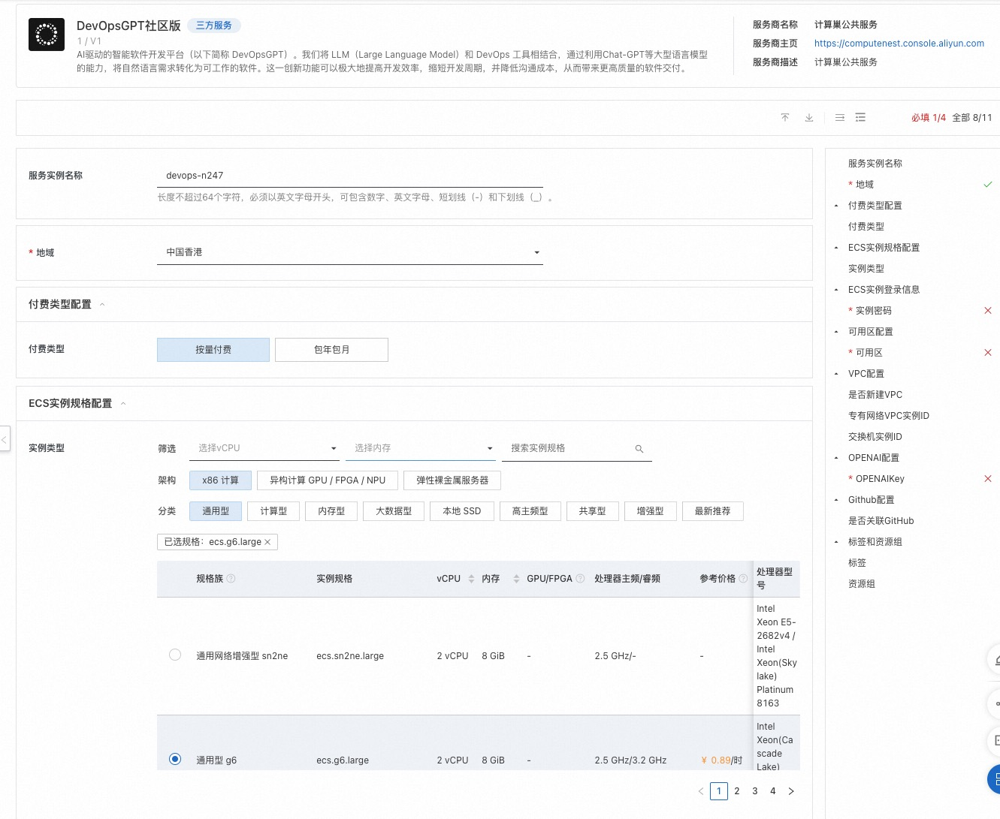
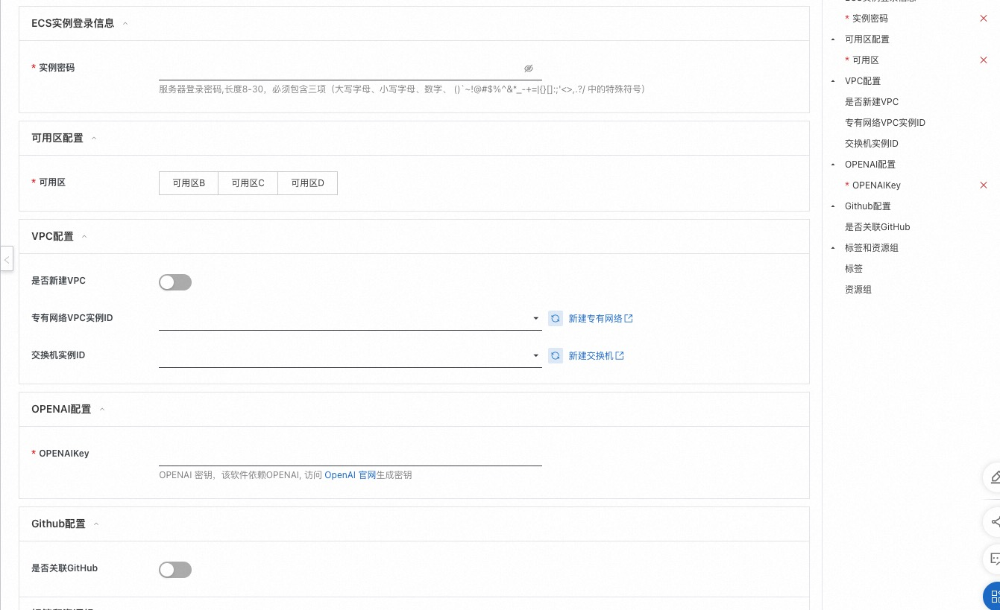
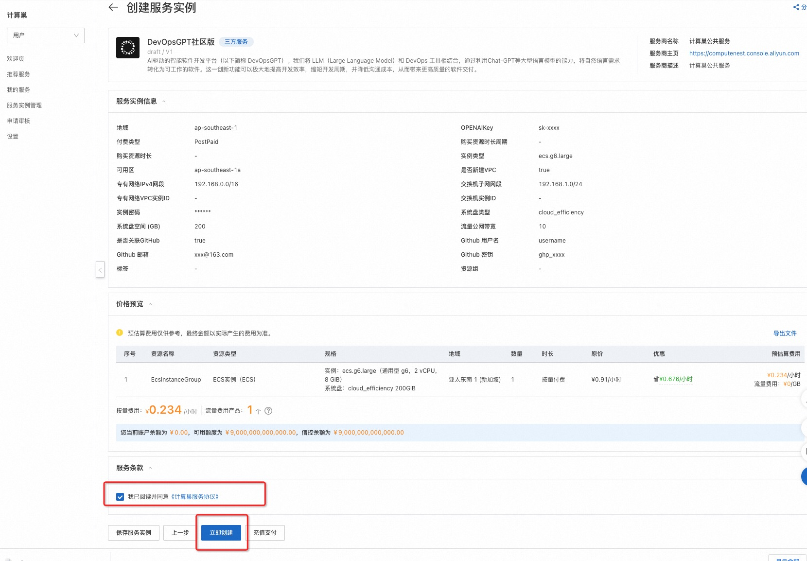
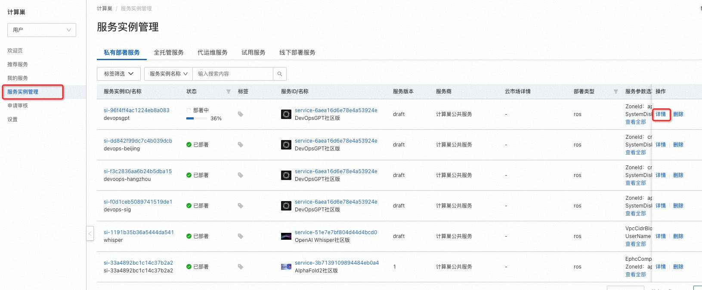
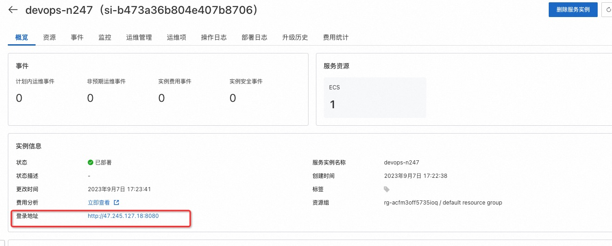
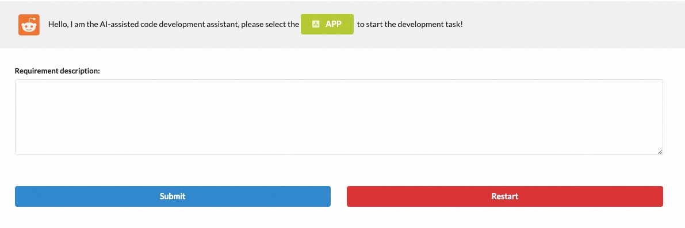
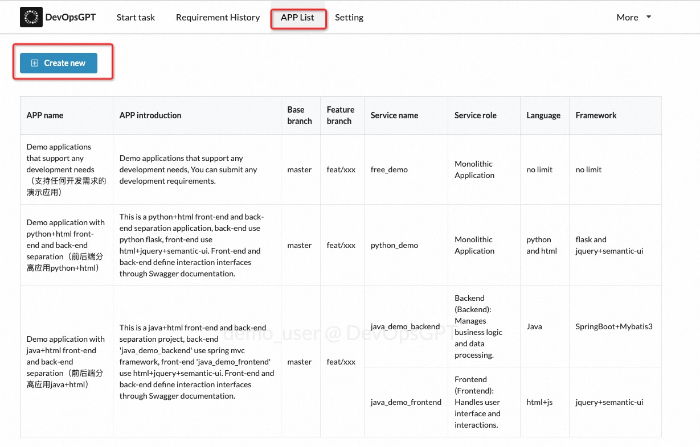
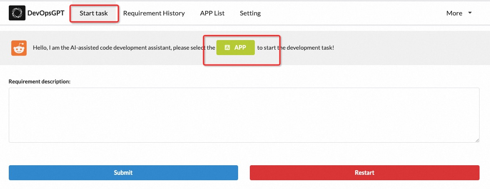
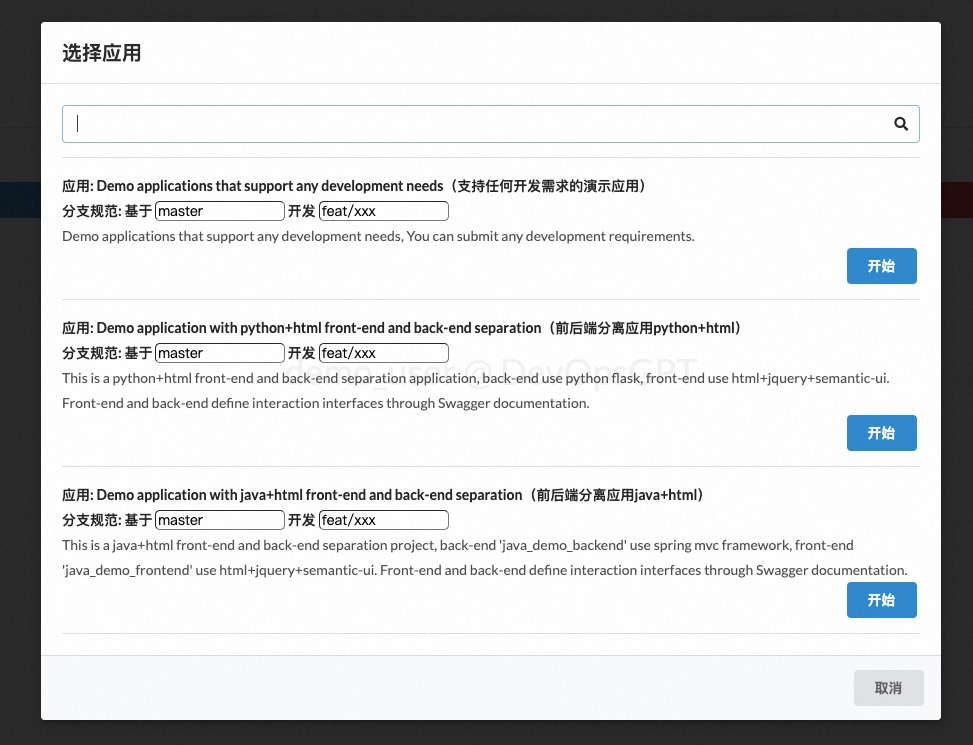
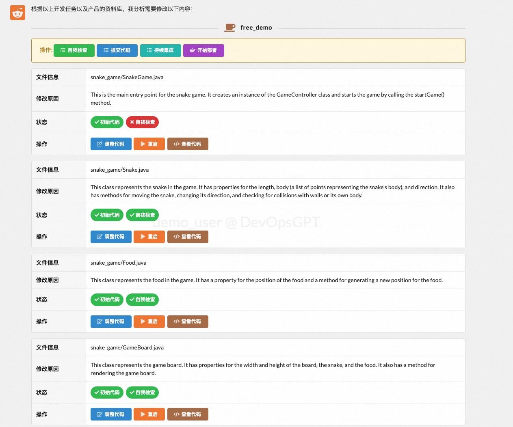

# DevOpsGPT社区版服务实例部署文档

## 概述

AI驱动的智能软件开发平台（以下简称 DevOpsGPT）。我们将 LLM（Large Language Model）和 DevOps 工具相结合，通过利用Chat-GPT等大型语言模型的能力，将自然语言需求转化为可工作的软件。这一创新功能可以极大地提高开发效率，缩短开发周期，并降低沟通成本，从而带来更高质量的软件交付。

## 计费说明

DevOpsGPT社区版在计算巢上的费用主要涉及：

- 所选vCPU与内存规格
- 磁盘容量
- 公网带宽

计费方式包括：

- 按量付费（小时）
- 包年包月

预估费用在创建实例时可实时看到

## RAM账号所需权限

DevOpsGPT服务需要对ECS、VPC等资源进行访问和创建操作，若您使用RAM用户创建服务实例，需要在创建服务实例前，对使用的RAM用户的账号添加相应资源的权限。添加RAM权限的详细操作，请参见[为RAM用户授权](https://help.aliyun.com/document_detail/121945.html)。所需权限如下表所示。

| 权限策略名称 | 备注 |
| --- | --- |
| AliyunECSFullAccess | 管理云服务器服务（ECS）的权限 |
| AliyunVPCFullAccess | 管理专有网络（VPC）的权限 |
| AliyunROSFullAccess | 管理资源编排服务（ROS）的权限 |
| AliyunComputeNestUserFullAccess | 管理计算巢服务（ComputeNest）的用户侧权限 |

### 部署步骤
1. 单击部署链接，进入服务实例部署界面
    https://computenest.console.aliyun.com/user/cn-hangzhou/serviceInstanceCreate?ServiceId=service-6aea16d6e78e4a53924e
2. 根据界面提示，填写参数完成部署
参考如下 部署参数说明 完成参数填写,并点击 下一步:确认订单 

3. 确认服务实例参数和预估价格，确认我已阅读并同意计算巢协议，点击立即创建

4. 在服务实例管理页面找到服务实例,并点击详情进入
5. 部署完成,点击url进入

### 部署参数说明

您在创建服务实例的过程中，需要配置服务实例信息。下文介绍DevOpsGPT社区版服务实例输入参数的详细信息。

| 参数组        | 参数项    | 示例           | 说明                        |
|------------|--------|--------------| --- |
| 服务实例名称     |        | test         | 实例的名称                     |
| 地域         |        | 华东1（杭州）      | 选中服务实例的地域，建议就近选中，以获取更好的网络延时。 |
| 付费类型配置    | 付费类型   | 按量付费 或 包年包月    |  |
| ECS实例规格配置    | 实例类型  | 	ecs.g7a.large     | ECS实例规格          |
| ECS实例登录信息    | 实例密码  | xxxx           | 设置实例密码。长度8~30个字符，必须包含三项（大写字母、小写字母、数字、()`~!@#$%^&*-+={}[]:;'<>,.?/ 中的特殊符号）          |
| 可用区配置      | 可用区   | 可用区I         | 可用区选择,可用区选择会影响交换机，实例规格等                |
| VPC配置 | 是否新建VPC | true      | 是否新建vpc               |
| VPC配置 | 专有网络VPC实例ID | vpc-xxx      | 是否新建VPC为false,选择已有vpc               |
| VPC配置 | 网络交换机ID | vsw-xxx      | 是否新建VPC为false,选择已有交换机                |
| VPC配置     | 专有网络IPv4网段   | 192.168.0.0/16  |是否新建VPC为true,设置vpc网段 
| VPC配置   | 交换机子网网段   | 192.168.1.0/24 | 是否新建VPC为true,设置交换机网段         |
| OPENAI配置    |  OPENAIKey  | sk-xxxx           | 底层调用openapi，需要访问密钥          |
| Github配置    | 是否关联GitHub | true         | github用户代码拉取和推送                 |
| Github配置    | Github 用户名 | xiaoming         | Github 用户名                  |
| Github配置    | Github 邮箱 | xxx@163,com         | Github 邮箱                  |
| Github配置    | Github 密钥 | ghp_xxx         | 配置你的 Git 令牌，可以从这里获取：https://github.com/settings/tokens                 |

参数详情参考：
https://github.com/kuafuai/DevOpsGPT/blob/master/docs/DOCUMENT_CN.md
### 验证结果&使用Demo
1. 根据部署步骤最后一步打开url,如下
 
2. 点击APP Lis(应用列表)t完成自定义应用的配置,主要包括应用基本信息,代码仓库地址,开发分支,CICD配置等,如果试用,也可直接使用示例应用

3. 点击 Start task(开发需求, 选择自定义/demo应用)

4.输入开发需求,根据页面交互,开始使用产品

5. 交互之后会生成接口文档和代码,可在页面进行编辑修改,点击 提交代码 可以推送到github代码仓库;代码仓库地址由服务实例-Github配置 和 应用配置里的APPS.service.git_path确定; 可参考https://github.com/kuafuai/DevOpsGPT/blob/master/docs/DOCUMENT_CN.md

6. 持续集成和代码部署相关,需要用户根据参考文档,登陆机器在/root/DevOpsGPT目录完成env.yaml等文件配置修改,重新执行 sh run.sh 生效

参考文档:https://github.com/kuafuai/DevOpsGPT/blob/master/docs/DOCUMENT_CN.md
